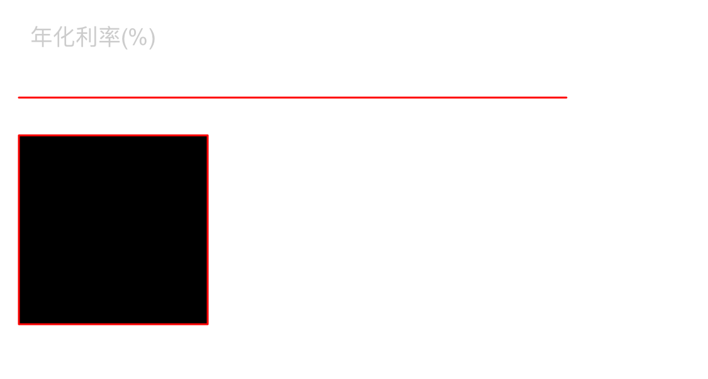

# react-native 使用 ART 制作图表
# react-native Draw chart use ART

```
$ git@github.com:Xigtun/react-native-chart-demo.git
$ cd react-native-chart-demo
$ yarn run ios

```
先看效果图


实现效果


由于图表比较简单，有一些需要自定义的地方，使用第三方框架需要熟悉接口，相对于自己画，时间成本都差不多，画出来更便于需求变更修改。（第三方表格框架推荐[ victory-native ](https://github.com/FormidableLabs/victory-native)和[ react-native-charts-wrapper ](https://github.com/wuxudong/react-native-charts-wrapper)。相对来说`victory-native`要好一点，`react-native-charts-wrapper`由于是对原生平台的封装，有些属性设置效果在两个平台是不一致的）。

画图可以使用 [react-native-svg](https://github.com/react-native-community/react-native-svg) 。由于表格比较简单，只包含线条、文字、矩形色块，使用 ART 已经很方便了。

#### ART 的基本使用
iOS 需要先本地添加 ART
先看一下基础用法


```
import React from 'react';
import { StyleSheet, View, ART, Dimensions } from 'react-native';
import PropTypes from 'prop-types'

const {Surface, Text, Path, Shape} = ART;

export default class Chart extends React.Component {

    static defaultProps = {
        height: 230,
        width: Dimensions.get('window').width,
    }

    static propTypes = {
        height: PropTypes.number,
        width: PropTypes.number
    }

    render() {
        const path = Path()
            .moveTo(10,40)
            .lineTo(300,40);

        const rectpath = Path()
            .moveTo(10,60)
            .lineTo(110,60)
            .lineTo(110,160)
            .lineTo(10,160)
            .close();
        return (
            <View style={styles.container}>
                <Surface width={this.props.width} height={this.props.height}>
                    <Text strokeWidth={0.5} x={16} y={0}  alignment = "left"  fill="#ccc" font={{
                        fontSize: 12,
                        fontFamily: 'Arial',
                        fontWeight: 100,
                    }}>年化利率(%)</Text>
                    <Shape d={path} stroke={'red'} strokeWidth={1} />
                    <Shape d={rectpath} fill={'#000'} stroke={'red'} strokeWidth={1} />
                </Surface>
            </View>
        );
    }
}

const styles = StyleSheet.create({
    container: {
        backgroundColor: '#fff'
    },
});
```


#### 画图


```
import React from 'react';
import { StyleSheet, View, ART, Dimensions } from 'react-native';
import PropTypes from 'prop-types'
const {Surface, Path, Shape} = ART;

const mTop = 30;
const mLeft = 50;
const mBottom = 40;
const mRight = 20

export default class Chart extends React.Component {

    static defaultProps = {
        height: 230,
        width: Dimensions.get('window').width,
        data: {
            step_info: [
                {
                    "x":"锁定期1",
                    "y":"12.00"
                },
                {
                    "x":"锁定期2",
                    "y": "12.50"
                },
                {
                    "x":"锁定期3",
                    "y": "13.00"
                },
                {
                    "x":"锁定期4",
                    "y": "13.50"
                },
                {
                    "x":"锁定期5",
                    "y": "14.00"
                },
                {
                    "x":"锁定期6",
                    "y": "14.50"
                }
            ],
            apr: '12',
            step_apr: '0.5',
            apr_max: '14.5',
            reward_apr: '0',
            first_apr: '0'
        }
    }

    static propTypes = {
        height: PropTypes.number,
        width: PropTypes.number
    }

    render() {
        const {width, height} = this.props
        let chartWidth = width-mRight-mLeft
        let chartHeight = height-mBottom-mTop
        const path = Path()
            .moveTo(mLeft,mTop)
            .lineTo(mLeft+chartWidth,mTop)
            .lineTo(mLeft+chartWidth,mTop+chartHeight)
            .lineTo(mLeft,mTop+chartHeight)
            .close();
        return (
            <View style={styles.container}>
                <Surface width={width} height={height}>
                    <ART.Text strokeWidth={0.5} x={16} y={0} fill="#ccc" font={{
                        fontSize: 14,
                        fontFamily: 'Arial',
                        fontWeight: 'normal',
                    }}>年化利率(%)</ART.Text>
                    <ART.Text strokeWidth={0.5} alignment={'right'} x={mLeft+chartWidth} y={mTop+chartHeight+20} fill="#ccc" font={{
                        fontSize: 14,
                        fontFamily: 'Arial',
                        fontWeight: 'normal',
                    }}>持有时长(天数)</ART.Text>
                    <Shape d={path} stroke={'ccc'} strokeWidth={1} />
                    {this._renderChartData()}
                </Surface>
            </View>
        );
    }

    _renderChartData(){
        const {width, height} = this.props
        let chartWidth = width-mRight-mLeft
        let chartHeight = height-mBottom-mTop

        let dataWidth = chartWidth/this.props.data.step_info.length

        let reverseInfo = this.props.data.step_info.slice().reverse()
        let maxApr = parseFloat(this.props.data.apr_max)
        let minApr = parseFloat(this.props.data.apr) - parseFloat(this.props.data.step_apr)
        let lineCount = (maxApr - minApr) / parseFloat(this.props.data.step_apr)
        let step_height = chartHeight/(lineCount)

        let result = this.props.data.step_info.map((e, i)=>{
            let lines = []

            //
            let minValue = parseFloat(this.props.data.apr)-parseFloat(this.props.data.step_apr)
            let x = mLeft+dataWidth * i
            let y =mTop + (parseFloat(reverseInfo[i].y)-minValue) / (parseFloat(this.props.data.apr_max) -minValue) *chartHeight-step_height
            let infoText = `${e.y}`
            if (i===0 && parseFloat(this.props.data.first_apr) > 0) {
                y = mTop + (parseFloat(reverseInfo[i].y)-parseFloat(this.props.data.first_apr)-minValue) / (parseFloat(this.props.data.apr_max) -minValue) *chartHeight-step_height
                infoText = `${e.y}+${this.props.data.first_apr}`
            } else if ( parseFloat(this.props.data.reward_apr) > 0 ){
                infoText = `${e.y}+${this.props.data.reward_apr}`
            }
            let dataHeight = chartHeight - y + mTop
            const path = ART.Path()
                .moveTo(mLeft,mTop+(i)*step_height)
                .lineTo(mLeft+chartWidth,mTop+(i)*step_height)
            // girdLine
            lines.push(<Shape d={path} stroke="#ccc" strokeWidth={0.5} />)

            //xaxis
            lines.push(
                this._renderXLabel(x+0.5*dataWidth, mTop+chartHeight+3, e.x)
            )

            // top line
            lines.push(
                this._renderBarTopLine(x, y, dataWidth)
            )

            // info
            lines.push(
                this._renderInfoLabel(x+0.5*dataWidth, y-14, infoText)
            )

            // rect
            lines.push(
                this._renderAData(x, y, dataWidth, dataHeight)
            )

            return lines
        })


        // yaxis
        let ys = []
        for (let i = maxApr; i > minApr; i-=parseFloat(this.props.data.step_apr)) {
            let yValue = i
            ys.push(
                this._renderYLabel(mLeft-20, mTop+(1-(i-minApr)/(maxApr-minApr))*chartHeight-7, yValue+parseFloat(this.props.data.reward_apr))
            )
        }
        result = result.concat(ys)

        return result
    }

    _renderYLabel(x, y, value){
        return (
            <ART.Text strokeWidth={1}
                      x={x}
                      y={y}
                      fill="#ccc"
                      font={{
                          fontSize: 12,
                          fontFamily: 'Arial',
                          fontWeight: 100
                      }}
                      alignment='center'
            >{this._formatChartApr(value)}</ART.Text>
        )
    }

    _renderXLabel(x, y, value){
        return (
            <ART.Text strokeWidth={1}
                      x={x}
                      y={y}
                      fill="#ccc"
                      font={{
                          fontSize: 12,
                          fontFamily: 'Arial',
                          fontWeight: 100
                      }}
                      alignment='center'
            >{value}</ART.Text>
        )
    }

    _renderBarTopLine(x, y, width){
        const path = ART.Path()
            .moveTo(x,y)
            .lineTo(x+width,y)
        return <Shape d={path} stroke="#FF6E00" strokeWidth={2} />
    }

    _renderInfoLabel(x, y, value){
        return (
            <ART.Text strokeWidth={1}
                      x={x}
                      y={y}
                      fill="#FF6E00"
                      font={{
                          fontSize: 10,
                          fontFamily: 'Arial',
                          fontWeight: 100
                      }}
                      alignment='center'
            >{value}</ART.Text>
        )
    }

    _renderAData(x, y, width, height){
        const path = new ART.Path()
            .moveTo(x, y)
            .lineTo(x+width, y)
            .lineTo(x+width,y+height)
            .lineTo(x,y+height)
            .close();

        return  <ART.Shape d={path} fill={'#FF6E0040'}/>

    }


    _formatChartApr(apr){
        return parseFloat(apr).toFixed(2).toString()
    }
}

const styles = StyleSheet.create({
    container: {
        backgroundColor: '#fff'
    },
});

```